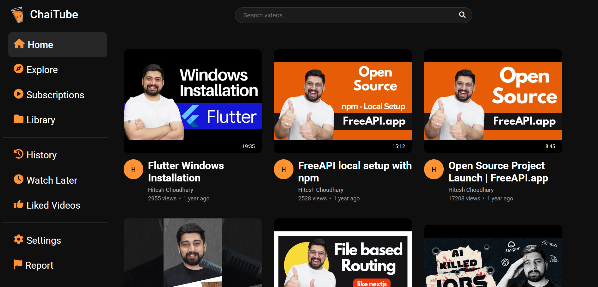

# 🌟 Chai Tube  

## 📝 Introduction and Overview  

**Chai Tube** is a simple yet powerful website that **lists YouTube videos** and allows users to **search for videos** and **redirect to YouTube** to watch them. 🎭✨  

---

## 🎯 Key Features  

✅ **List Videos** - Displays a list of YouTube videos on page load.  
✅ **Search Videos** - Users can search for specific videos. 🔍  
✅ **Infinite Scroll** - Loads more videos when clicks on bottom button 🔄  
✅ **Redirect to YouTube** - Clicking on a video redirects users to YouTube. 🎥  
✅ **Responsive UI** - Works seamlessly across all devices. 📱💻  

---

## 🛠️ Tech Stack  

- **Frontend:** HTML, CSS, JavaScript  
- **APIs Used:**  
  - **Free API** - Fetches YouTube videos 🗣️  

---

## ✨ Features in Detail  

### 📜 1. List Videos on Page Load  
- Fetches and displays a list of YouTube videos from an external API.  
- Ensures the latest and most relevant videos are shown.  

### 🎨 2. Search Videos  
- Allows users to search for specific videos based on keywords.  
- Provides **real-time filtering** for a better user experience.  

### 🔄 3. Infinite Scroll  
- Automatically loads more videos as the user scrolls down the page.  
- Ensures a **seamless browsing experience** without manual refreshing.  

### 🎥 4. Redirects to YouTube  
- Clicking on any video redirects users to **YouTube** to watch the content.  
- Ensures smooth navigation without cluttering the UI.  

---

## 🎨 Design Concept  

🌿 **Theme Inspiration:**  
- Inspired by **ChaiCode**, **Alumni Network**, and **YouTube**.  
- A clean and intuitive **UI/UX** with **minimalistic design** for easy navigation.  

---

## 🔗 API Reference  

### 📜 Fetch YouTube Videos  

```http
GET https://api.freeapi.app/api/v1/public/youtube/videos?page=1&limit=10&query=javascript&sortBy=mostLiked
```

| 🔑 Parameter | 🏷️ Type    | 📖 Description                    |
| :-------- | :------- | :-------------------------------- |
| `page`      | `string` | **Required**. Page number for pagination.|
|`limit`|  `string` | Number of videos to fetch per request🔍.

---

## 🎥 Demo

Vercel link - https://chai-tube-nileshkurreys-projects.vercel.app/

---


## Screenshots
📌 1. Design on Page Load: 


--- 

## 👨‍💻 Author

- [@NileshKurrey](https://github.com/NileshKurrey)


📢 Thank you for checking out my project! 💙✨