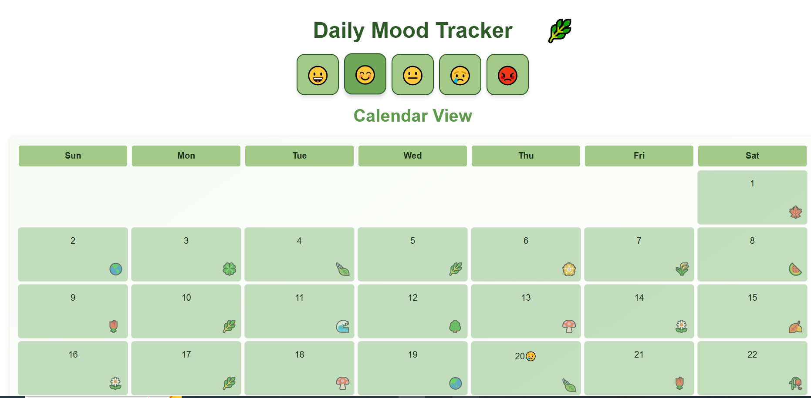

# 🌟 Mood Tracker

## 📝 Introduction and Overview

**Mood Tracker** is a simple yet powerful website that helps you **track your daily mood** effortlessly. Users can record their mood using intuitive emoji buttons, view their mood entries on a calendar, and check their mood timeline over time. 🎭✨

---

## 🎯 Key Features

✅ **Track Daily Mood** - Record your emotional state with a single click.  
✅ **Calendar View** - Visualize your mood entries on a monthly calendar.  
✅ **Mood Timeline** - Review your mood history in a chronological timeline.  
---

## 🛠️ Tech Stack

- **Frontend:** HTML, CSS, JavaScript  
- **Storage:** LocalStorage for persisting mood entries

---

## ✨ Features in Detail

### 📜 1. Track Daily Mood  
- Users select a mood from a set of emoji buttons to record their mood for the day.  
- Each mood entry is stored with the current date for accurate tracking.

### 🎨 2. Calendar View  
- Displays your mood entries on a grid-based calendar.  
- Days without an entry show just the date, while days with an entry display the selected mood.

### 🔄 3. Mood Timeline  
- Shows a list of your mood entries over time with dates, making it easy to reflect on your emotional trends.

---

## 🎨 Design Concept

🌿 **Theme Inspiration:**  
- Inspired by the calming effect of nature, our design features a lush, green aesthetic that promotes relaxation and mindfulness.  
- The UI is clean and minimalistic, ensuring an intuitive user experience.

---

## Screenshots

📌 **1. Mood Tracker on Page Load:**  

---

## 👨‍💻 Author

- [@NileshKurrey](https://github.com/NileshKurrey)

---

📢 **Thank you for checking out my project!** 💙✨
